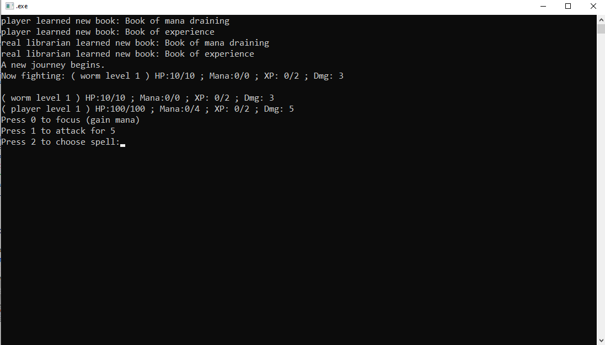

# **Library_dungeon_escape**

## Chosen theme and a short description: 

The theme of library taken in a gaming direction. A short game about trying to escape a library by gettin new spellbooks and fighting enemies.

*scope*: terminal based (text) C++ game for school project.

*goal*: manage mana, grow your spellbook inventory and escape a library full of enemies.

## A list of the features your app currently has: 

### The app is a playable game containing:

- implementation of basic stats such as: hit points, mana, damage.
- implementation of level (and experience points) that scales those stats and changes environment.
- options to choose 3 actions: mana recovery, physical damage or cast a spellbook.
- options to choose available spellbooks based on player level (up to 7 spellbooks).
- 9 enemies with different stats and behaiviour for attacking (e.g., physical attack, mana draining, using spellbooks and combinations).
- enemies are chosen at random (including level) and attacks have a miss chance of 20%.
- a win condition: beating the actual librarian (lorewise stealing their access card and escaping) appearing after level 7.

### requirements fullfilment:

 - two different inheritance hierarchies: Being hierarchy (Player, Enemy), Book hierarchy (spellbooks implementations)
 - protected member and method:hitChance, die() are protected in Being class.
 - base parameterized constructor called in derived: Player calls Being with its stats (name "player",hp 100,mana 4,dmg 5).
 - abstract class: Book with its "use()" function for the specific behaviour specified in spellbooks.
 - 2 virtual methods: die() in the Hp class, attackLogic() in Being.
 - 2 polymorphism: spellsLearned from Player class, fightableEnemies from Game class.
 - 2 upcasting: literally the adding to the polymorfic variables above mentioned.
 - custom exception: notEnoughMana in Book header.
 - 2 error throws: Exp::lvl(int) throws if level is negative, Book cast throws if not enough mana.
 - try catch: Game catches if player doesn't have enough mana and promopts user for different action.
 - static member: Player is static inside Game (in case same player could be in multiple games).
 - 2 static functions: everything in Game class since they all just depend on the static player.

 Bonus:
 
 - hpp and cpp: in include folder are .hpps and in src are .cpps
 - diamond inheritance: ActualLibrarian is both a Enemy and a Player (which are all Beings).
